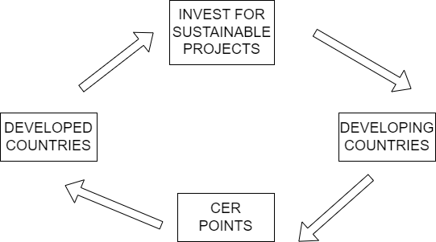

# EVS NOTES
## EIA
- For any development project  Ministry of Environment and Forests (MoEF) require clearance regarding how would the project affect the environment.
- **Environment Impact Assessment (EIA)** is the evaluation of the detail about a project affecting environment in physical, biological and social parameters.
- After the Environmental Protection Act of 1986 was passed, it is mandatory to submit the details for EIA
- **Points to be listed in EIA:**
    1. Impact on water, soil and air
    2. Impact on flora and fauna, specify whether any endangered species are affected or not.
    3. Impact on local people
- **Green field projects**: New project started from scratch.
- **Brown field projects**: Extension of old projects.
- **Steps involved in passing EIA document**:
    1. To get an environmental clearance the proposer of the project is expected to apply to the State Pollution  Control  Board(PCB).  
    2. The  PCB  checks  and  confirms  that  the  EIA  can  be  initiated.
    3.  The environmental clearance is evaluated and the report is submitted to the proposer
    4.  A  Report  of  the  Environmental  Statement  is  forwarded  to  the  MoEF.  
## Clean Development Mechanism(CDM)
- **Explanation**: https://youtu.be/udghNwZge8Y?si=Q_csyyxyoM5_lVS4
- It is proposal passed by United Nations in Kyoto Protocol where developed countries invest on developing countries For sustainable development(to reduce carbon emissions) And they get CER points in return.

- 1 cer= 1 ton carbon reduction
- **Carbon credits**: the buyer pays another company to take some action to reduce its greenhouse gas emissions, and the buyer gets credit for the reduction.
## Environmental Management system ISO-14000
- These are the protocols given by ISO which ensures that the company is certified with it must be safe for the environment.
- **Internal factors**: Factors affecting inside factory.
Eg, Noise,Ventilation,Soil precautions,etc.
- **External factors**: Factors affecting outside factory. Eg,Air,Water,Waste Deposits,etc.
## Green building
- **Defn**: A green building is a clean, sustainable building, designed with natural materials, uses little energy and renewable ones at that, is easy to maintain and available at a reasonable cost.
- A green building is designed to reduce the overall impact of the built-up environment on human health and the natural environment, through: 
    - The efficient use of energy, water and other resources
    - Protecting occupant health and improving employee productivity
    -  Reducing waste, pollution and harm to the environment.